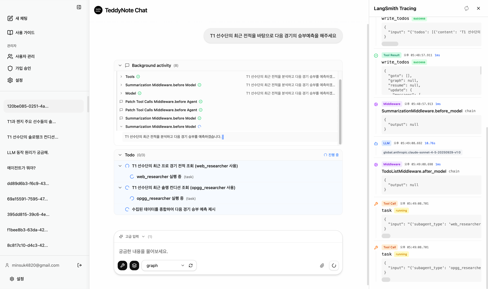
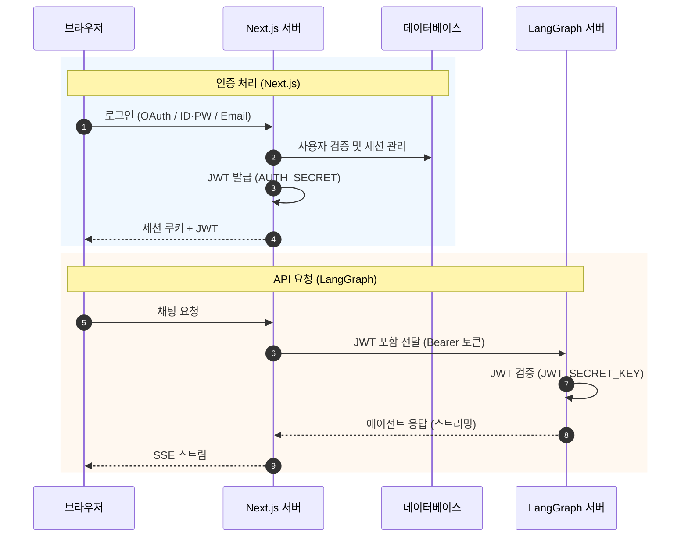

<div align="center">

# LangGraph Chat UI



**LangGraph 에이전트를 위한 채팅 인터페이스 — 인증, 관리자 대시보드, 다중 서버 관리 지원**

[](https://nextjs.org/)
[](https://react.dev/)
[](https://www.typescriptlang.org/)
[](https://tailwindcss.com/)
[](LICENSE)

[English](./README.md) | 한국어

[문서](docs/) · [예제](examples/) · [이슈 제보](https://github.com/teddynote-lab/langgraph-chat-ui/issues)

</div>

---

## 목차

- [소개](#소개)
- [주요 기능](#주요-기능)
- [빠른 시작](#빠른-시작)
- [설정](#설정)
- [인증 시스템](#인증-시스템)
- [관리자 대시보드](#관리자-대시보드)
- [보안](#보안)
- [배포](#배포)
- [기술 스택](#기술-스택)
- [기여하기](#기여하기)
- [라이선스](#라이선스)

---

## 소개

LangGraph Chat UI는 [LangGraph](https://github.com/langchain-ai/langgraph) 에이전트와 상호작용하기 위한 Next.js 기반 웹 애플리케이션입니다. 사용자 인증(NextAuth), 사용자/가입 관리가 가능한 관리자 대시보드, 여러 LangGraph 서버 연결을 하나의 인터페이스에서 관리하는 기능을 제공합니다.

- 여러 LangGraph 서버에 연결하고 그래프 간 전환
- NextAuth 기반 인증 (credentials, OAuth, email) + 역할 기반 접근 제어
- 관리자 대시보드: 사용자 관리, 가입 승인, 기능 토글
- Server Action 인증 체크, SSRF 방지, CORS 제한, 쿠키 보안

---

## 주요 기능

<details>
<summary><b>채팅 인터페이스</b></summary>

- SSE 기반 실시간 응답 스트리밍
- 여러 LangGraph 서버 연결 관리 및 단일 서버 내 그래프 전환
- 도구 호출 시각화 및 서브그래프 중간 노드 실행 과정 실시간 추적
- 스레드 관리: 대화 기록 저장, 이름 변경, 삭제
- 파일 업로드 (이미지 및 첨부파일)
- KaTeX 기반 LaTeX 렌더링, LangSmith 추적 연동
- `input_schema` 기반 자동 폼 UI 생성

</details>

<details>
<summary><b>인증 및 사용자 관리</b></summary>

- NextAuth 통합: credentials, OAuth (Google, GitHub 등), email
- 회원가입 정책: 자유 가입 또는 관리자 승인
- 사용자 상태: 활성 / 대기 / 정지
- 역할 기반 접근: 관리자(admin) / 일반 사용자(user)
- `requireAuth`를 통한 모든 서버 액션 인증 체크

</details>

<details>
<summary><b>관리자 대시보드</b></summary>

- 사용자 관리: 목록 조회, 역할/상태 변경, 삭제
- 대기 중인 가입 요청 승인/거부
- 전역 설정: 기능 토글, 기본 Connection 값
- 사용자 관리 작업에 대한 감사 로그

</details>

<details>
<summary><b>커스터마이징</b></summary>

- 브랜딩: 로고, 앱 이름, 설명 커스터마이징
- 다크 / 라이트 / 자동 테마 (시스템 설정 연동)
- 대화 시작 예시 질문 설정
- 마크다운 기반 사용자 가이드 페이지

</details>

---

## 빠른 시작

### 요구사항

- **Node.js** 18.x 이상
- **pnpm** 8.x 이상
- **LangGraph 서버** 실행 중 (`langgraph dev`)

### 설치 및 실행

```bash
# 1. 저장소 복제
git clone https://github.com/teddynote-lab/langgraph-chat-ui.git
cd langgraph-chat-ui

# 2. 의존성 설치
pnpm install

# 3. 대화형 설정 및 실행
pnpm launch
```

`pnpm launch` 명령어를 실행하면 대화형 설정 마법사가 시작됩니다:

1. **실행 모드 선택** — Development / Production
2. **인증 모드 선택** — standalone, credentials, oauth, oauth-direct
3. **LangGraph 서버 URL** 입력
4. **LangSmith API 키** 입력 (선택)
5. **데이터베이스 마이그레이션** 자동 실행 (인증 모드에 따라)
6. **서버 자동 시작**

> 언어는 시스템 로케일에 따라 자동 감지됩니다 (한국어/English).

> 인증 모드별 상세 설정은 `examples/` 폴더의 예제를 참고하세요.

### 인증 모드

| 모드 | 설명 | NextAuth | DB 필요 |
|---|---|---|---|
| `standalone` | 인증 없이 바로 사용 (로컬 개발용) | - | - |
| `credentials` | 이메일/비밀번호 로그인 | O | O |
| `oauth` | Google, GitHub 등 OAuth 로그인 | O | O |
| `oauth-direct` | LangGraph 서버가 OAuth 처리 | - | - |

### 환경 변수 (수동 설정)

`pnpm launch`를 사용하지 않고 수동으로 설정하려면:

```bash
cp .env.example .env
```

```env
# 인증 모드 (standalone, credentials, oauth, oauth-direct)
AUTH_MODE=standalone

# LangGraph 서버 URL
NEXT_PUBLIC_API_URL=http://localhost:2024

# 기본 Graph ID (선택)
NEXT_PUBLIC_ASSISTANT_ID=agent

# NextAuth 시크릿 (credentials, oauth, email 모드에서 필요)
NEXTAUTH_SECRET=your-secret-key

# 데이터베이스 (credentials, oauth, email 모드에서 필요)
DATABASE_URL="file:./prisma/dev.db"

# LangSmith 추적 (선택)
LANGSMITH_API_KEY=lsv2_pt_xxxxx
```

```bash
# 데이터베이스 마이그레이션 (credentials, oauth, email 모드에서 필요)
pnpm prisma migrate dev

# 개발 서버 실행
pnpm dev
```

브라우저에서 `http://localhost:3000`으로 접속합니다.

### 첫 번째 관리자 계정

인증 모드가 `credentials`, `oauth`, `email`인 경우, 최초 회원가입한 사용자는 자동으로 관리자 권한을 부여받습니다.

---

## 설정

### 앱 설정 파일

설정은 `src/configs/` 디렉토리에서 관리됩니다.

| 파일 | 설명 |
|---|---|
| `site.ts` | 앱 전체 설정 (브랜딩, 테마, UI 동작) |

### 주요 설정 항목

```typescript
// src/configs/site.ts
export const siteConfig = {
  meta: {
    title: "My Chat",
    description: "AI 어시스턴트",
  },
  branding: {
    appName: "My Chat",
    logoPath: "/logo.png",
    description: "무엇이든 물어보세요.",
  },
  buttons: {
    enableFileUpload: true,
    chatInputPlaceholder: "메시지를 입력하세요.",
  },
  threads: {
    showHistory: true,
    enableDeletion: true,
  },
  theme: {
    colorScheme: "auto", // light, dark, auto
  },
};
```

### Connection 관리

앱 실행 후 설정에서 여러 LangGraph 서버를 관리할 수 있습니다.

| 필드 | 필수 | 설명 |
|---|---|---|
| API URL | O | LangGraph 서버 URL |
| Connection 이름 | - | 구분을 위한 이름 |
| Assistant ID | - | Graph ID (미입력시 목록 선택) |
| API 키 | - | LangSmith API 키 |

---

## 인증 시스템

### 아키텍처

Next.js에서 DB 기반 사용자 인증을 처리하고, LangGraph 서버는 JWT 검증만 수행합니다.



### 핵심 원칙

| 구성 요소 | 역할 | DB 접근 |
|---|---|---|
| **Next.js** | 사용자 인증, DB 관리, JWT 발급 | O |
| **LangGraph** | JWT 검증, 에이전트 실행 | - |

> **중요**: `AUTH_SECRET` (Next.js)과 `JWT_SECRET_KEY` (LangGraph)는 동일한 값이어야 합니다.

### 지원 데이터베이스

**SQLite** (개발), **PostgreSQL**, **MySQL**을 지원합니다. `DATABASE_PROVIDER` 환경변수 (`sqlite`, `postgresql`, `mysql`)와 해당 `DATABASE_URL`을 설정하세요. 스키마 설정은 `pnpm db:setup`으로 자동 처리됩니다.

### 회원가입 정책

관리자 대시보드에서 설정 가능:

| 정책 | 동작 |
|---|---|
| `open` | 자유 가입 (기본값) |
| `approval` | 관리자 승인 후 활성화 |

### 사용자 상태

| 상태 | 설명 |
|---|---|
| `active` | 정상 사용 가능 |
| `pending` | 승인 대기 중 (로그인 불가) |
| `suspended` | 정지됨 (로그인 불가) |

### LangGraph 서버 인증 연동

LangGraph Platform에 JWT 기반 인증을 연동하는 방법은 [인증 가이드 개요](docs/00-OVERVIEW.ko.md)를 참고하세요.

---

## 관리자 대시보드

`/admin` 경로에서 관리자 기능에 접근할 수 있습니다.

### 사용자 관리

- 전체 사용자 목록 조회
- 역할 변경 (관리자 / 일반 사용자)
- 상태 변경 (활성화 / 정지)
- 사용자 삭제

### 가입 승인

회원가입 정책이 `approval`일 때:

- 대기 중인 가입 요청 목록
- 승인 또는 거부 처리

### 전역 설정

| 설정 | 설명 |
|---|---|
| 회원가입 정책 | open / approval |
| 기능 활성화 | 각 기능별 on/off |
| 기본 Connection | 서버 전역 기본값 설정 |
| Connection 선택 | 사용자의 Connection 변경 허용 여부 |

---

## 보안

| 영역 | 조치 |
|---|---|
| **Server Actions** | 모든 서버 액션에 인증 체크 (`requireAuth`) |
| **API 프록시** | SSRF 방지 (프라이빗 IP 차단), CORS 출처 제한 |
| **쿠키 보안** | Connection 쿠키에 `httpOnly`, `secure` 플래그 적용 (프로덕션 환경만) |
| **파일 업로드** | MIME 타입 기반 확장자 결정, SVG XSS 방지 |
| **JWT** | 공유 시크릿 기반 서버 간 인증, 안전한 토큰 생성 |
| **데이터 무결성** | Prisma 트랜잭션으로 원자적 사용자 상태 변경 |
| **입력 검증** | LangSmith API의 UUID 형식 검증 |

---

## 배포

### 배포 옵션

| 옵션 | LangSmith 필요 | 인프라 | 권장 용도 |
|---|---|---|---|
| LangGraph Platform | O (무료 가능) | Redis + PostgreSQL | 공식 지원, 빠른 설정 |
| FastAPI Standalone | - | 선택적 | 완전 독립, 커스텀 |

자세한 내용은 [LangGraph 서버 배포 가이드](docs/LANGGRAPH_DEPLOYMENT_GUIDE.ko.md)를 참고하세요.

### Docker 배포

```bash
# 기본 (UI + PostgreSQL)
docker compose up -d

# 통합 스택 (UI + LangGraph 서버 + PostgreSQL + Redis)
docker compose -f docker-compose.full.yml up -d
```

설정 옵션은 `docker-compose.yml`을 참고하세요. `NEXT_PUBLIC_API_URL`을 LangGraph 서버 엔드포인트로 설정합니다.

### Vercel 배포

[](https://vercel.com/new/clone?repository-url=https://github.com/teddynote-lab/langgraph-chat-ui)

> **참고**: Vercel은 서버리스 환경이므로 SQLite를 사용할 수 없습니다. 반드시 PostgreSQL을 사용해야 합니다.

1. Vercel에서 저장소 연결
2. `DATABASE_PROVIDER=postgresql`과 `DATABASE_URL` 설정 (Vercel Postgres 또는 외부 DB)
3. 나머지 환경 변수 설정 (`AUTH_MODE`, `NEXT_PUBLIC_API_URL` 등)

---

## 기술 스택

| 영역 | 기술 |
|---|---|
| 프레임워크 | Next.js 15 (App Router) |
| UI 라이브러리 | React 19, Radix UI, Framer Motion |
| 스타일링 | Tailwind CSS 4 |
| 언어 | TypeScript 5.7 |
| 인증 | NextAuth.js 5 (Auth.js) |
| 데이터베이스 | Prisma ORM (SQLite / PostgreSQL) |
| LangGraph | @langchain/langgraph-sdk |
| 마크다운 | react-markdown, KaTeX, remark-gfm |

---

## 문서

| 문서 | 설명 |
|---|---|
| [빠른 시작](docs/QUICK_START.md) | 5분 안에 실행 (standalone, 인증 없음) |
| [통합 가이드](docs/INTEGRATION.md) | LangGraph 서버 연결 + JWT 인증 설정 |
| [프로덕션 배포](docs/PRODUCTION.md) | Docker, Vercel, 자체 호스팅 배포 |
| [환경변수 매트릭스](docs/ENV_MATRIX.md) | auth mode별 전체 환경변수 (필수/선택) |
| [트러블슈팅](docs/TROUBLESHOOTING.md) | 자주 발생하는 에러와 해결법 |
| [인증 가이드 개요](docs/00-OVERVIEW.ko.md) | 인증 방식 비교 및 선택 가이드 |
| [예제 모음](examples/) | 인증 모드별 서버/프론트엔드 설정 예제 |

사용자 가이드는 `public/full-description.md`에서 편집할 수 있습니다. 마크다운 문법을 사용하여 앱 내 도움말 페이지를 커스터마이징하세요.

---

## 기여하기

```bash
pnpm install
pnpm dev          # 개발 서버 (:3000)
pnpm lint         # ESLint
pnpm format:check # Prettier
pnpm build        # 프로덕션 빌드
```

Fork 후 브랜치를 만들어 PR을 제출해주세요. 제출 전 `pnpm lint`와 `pnpm format:check`를 실행해주세요 — CI에서 두 검사를 통과하지 못한 PR은 머지할 수 없습니다.

---

## 라이선스

이 프로젝트는 [MIT 라이선스](LICENSE) 하에 배포됩니다.

---

## 참고 자료

- [LangGraph 공식 문서](https://langchain-ai.github.io/langgraph/)
- [LangSmith 플랫폼](https://smith.langchain.com) — 에이전트 추적 및 모니터링
- [Next.js 문서](https://nextjs.org/docs)
- [NextAuth.js 문서](https://authjs.dev/)
- [테디노트 YouTube](https://youtube.com/c/teddynote)

---

<div align="center">
<sub>Built by <a href="https://github.com/teddynote-lab">TeddyNote Lab</a>, based on <a href="https://github.com/langchain-ai/agent-chat-ui">langchain-ai/agent-chat-ui</a></sub>
</div>
