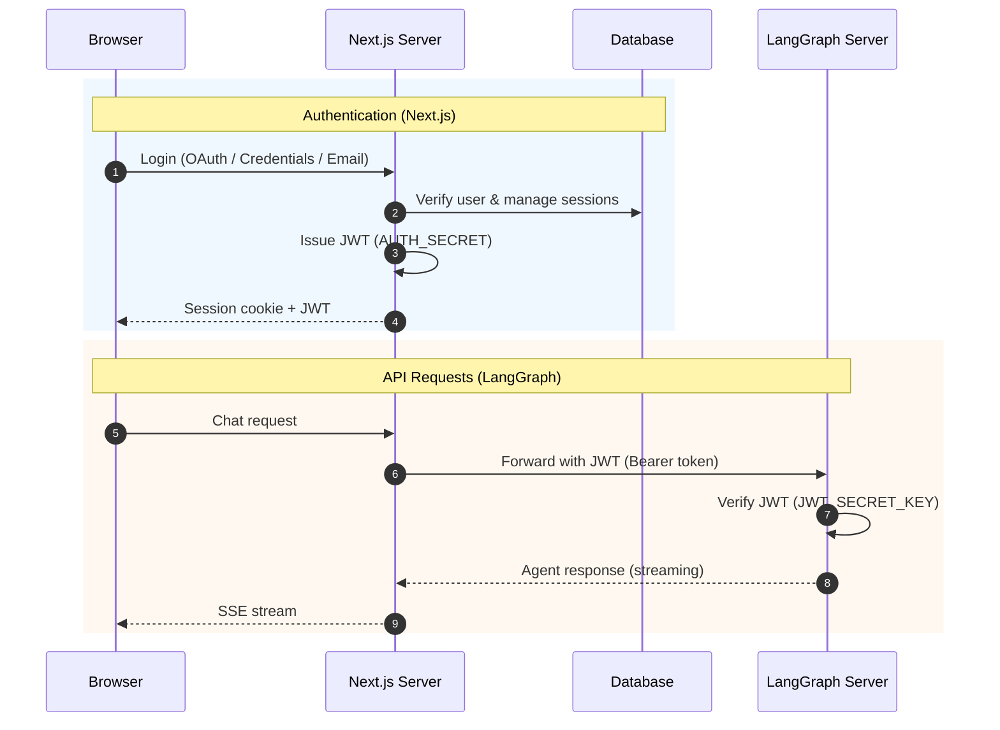

<div align="center">

# LangGraph Chat UI


**Chat interface for LangGraph agents with auth, admin dashboard, and multi-server management**

[](https://nextjs.org/)
[](https://react.dev/)
[](https://www.typescriptlang.org/)
[](https://tailwindcss.com/)
[](LICENSE)

English | [한국어](./README.ko.md)

[Docs](docs/) · [Examples](examples/) · [Report Issue](https://github.com/teddynote-lab/langgraph-chat-ui/issues)

</div>

---

## Table of Contents

- [Introduction](#introduction)
- [Features](#features)
- [Quick Start](#quick-start)
- [Configuration](#configuration)
- [Authentication](#authentication)
- [Admin Dashboard](#admin-dashboard)
- [Security](#security)
- [Deployment](#deployment)
- [Tech Stack](#tech-stack)
- [Contributing](#contributing)
- [License](#license)

---

## Introduction

LangGraph Chat UI is a Next.js-based web application for interacting with [LangGraph](https://github.com/langchain-ai/langgraph) agents. It provides user authentication (NextAuth), an admin dashboard with user/signup management, and the ability to manage multiple LangGraph server connections from a single interface.

- Connect to multiple LangGraph servers and switch between graphs
- NextAuth-based auth (credentials, OAuth, email) with role-based access control
- Admin dashboard for user management, signup approval, and feature toggles
- Server Action auth checks, SSRF prevention, CORS restrictions, cookie security

---

## Features

<details>
<summary><b>Chat Interface</b></summary>

- SSE-based real-time response streaming
- Manage multiple LangGraph server connections and switch between graphs on a single server
- Visualize tool calls and track intermediate subgraph node execution in real-time
- Thread management: save, rename, delete conversation history
- File upload (images and attachments)
- KaTeX-based LaTeX rendering, LangSmith trace linking
- Automatic form UI generation from `input_schema`

</details>

<details>
<summary><b>Authentication & User Management</b></summary>

- NextAuth integration: credentials, OAuth (Google, GitHub, etc.), email
- Signup policy: open signup or admin approval required
- User status: active / pending / suspended
- Role-based access: admin and regular user roles
- Auth checks on all server actions via `requireAuth`

</details>

<details>
<summary><b>Admin Dashboard</b></summary>

- User management: list, role/status changes, deletion
- Approve or reject pending signup requests
- Global settings: feature toggles, default connection values
- Audit logging for user management operations

</details>

<details>
<summary><b>Customization</b></summary>

- Branding: custom logo, app name, description
- Dark / light / auto theme (follows system preference)
- Configurable conversation starter questions
- Markdown-based user guide page

</details>

---

## Quick Start

### Prerequisites

- **Node.js** 18.x or later
- **pnpm** 8.x or later
- **LangGraph server** running (`langgraph dev`)

### Installation

```bash
# 1. Clone the repository
git clone https://github.com/teddynote-lab/langgraph-chat-ui.git
cd langgraph-chat-ui

# 2. Install dependencies
pnpm install

# 3. Interactive setup and launch
pnpm launch
```

Running `pnpm launch` starts an interactive setup wizard:

1. **Run mode** — Development / Production
2. **Auth mode** — standalone, credentials, oauth, oauth-direct
3. **LangGraph server URL** input
4. **LangSmith API key** input (optional)
5. **Database migration** (auto, depending on auth mode)
6. **Auto-start server**

> Language is auto-detected based on your system locale.

> See the `examples/` directory for detailed per-mode configuration examples.

### Auth Modes

| Mode | Description | NextAuth | DB Required |
|---|---|---|---|
| `standalone` | No auth, immediate use (local dev) | - | - |
| `credentials` | Email/password login | Yes | Yes |
| `oauth` | Google, GitHub, etc. OAuth login | Yes | Yes |
| `oauth-direct` | LangGraph server handles OAuth | - | - |

### Environment Variables (Manual Setup)

To configure manually instead of using `pnpm launch`:

```bash
cp .env.example .env
```

```env
# Auth mode (standalone, credentials, oauth, oauth-direct)
AUTH_MODE=standalone

# LangGraph server URL
NEXT_PUBLIC_API_URL=http://localhost:2024

# Default Graph ID (optional)
NEXT_PUBLIC_ASSISTANT_ID=agent

# NextAuth secret (required for credentials, oauth, email modes)
NEXTAUTH_SECRET=your-secret-key

# Database (required for credentials, oauth, email modes)
DATABASE_URL="file:./prisma/dev.db"

# LangSmith tracing (optional)
LANGSMITH_API_KEY=lsv2_pt_xxxxx
```

```bash
# Database migration (required for credentials, oauth, email modes)
pnpm prisma migrate dev

# Start dev server
pnpm dev
```

Open `http://localhost:3000` in your browser.

### First Admin Account

When using `credentials`, `oauth`, or `email` auth modes, the first user to sign up is automatically granted admin privileges.

---

## Configuration

### Config Files

Configuration is managed in the `src/configs/` directory.

| File | Description |
|---|---|
| `site.ts` | App-wide settings (branding, theme, UI behavior) |

### Key Settings

```typescript
// src/configs/site.ts
export const siteConfig = {
  meta: {
    title: "My Chat",
    description: "AI Assistant",
  },
  branding: {
    appName: "My Chat",
    logoPath: "/logo.png",
    description: "Ask me anything.",
  },
  buttons: {
    enableFileUpload: true,
    chatInputPlaceholder: "Type a message...",
  },
  threads: {
    showHistory: true,
    enableDeletion: true,
  },
  theme: {
    colorScheme: "auto", // light, dark, auto
  },
};
```

### Connection Management

After launching the app, you can manage multiple LangGraph servers from the settings panel.

| Field | Required | Description |
|---|---|---|
| API URL | Yes | LangGraph server URL |
| Connection Name | No | Display name for identification |
| Assistant ID | No | Graph ID (shows list if empty) |
| API Key | No | LangSmith API key |

---

## Authentication

### Architecture

Next.js handles DB-based user authentication, while the LangGraph server only performs JWT verification.



### Core Principles

| Component | Role | DB Access |
|---|---|---|
| **Next.js** | User auth, DB management, JWT issuance | Yes |
| **LangGraph** | JWT verification, agent execution | No |

> **Important**: `AUTH_SECRET` (Next.js) and `JWT_SECRET_KEY` (LangGraph) must be the same value.

### Supported Databases

Supports **SQLite** (development), **PostgreSQL**, and **MySQL**. Set `DATABASE_PROVIDER` env var (`sqlite`, `postgresql`, `mysql`) and the matching `DATABASE_URL`. Schema setup is handled automatically by `pnpm db:setup`.

### Signup Policy

Configurable from the admin dashboard:

| Policy | Behavior |
|---|---|
| `open` | Open signup (default) |
| `approval` | Admin approval required |

### User Status

| Status | Description |
|---|---|
| `active` | Normal access |
| `pending` | Awaiting approval (login disabled) |
| `suspended` | Suspended (login disabled) |

### LangGraph Server Auth Integration

For JWT-based authentication with LangGraph Platform, see the [Auth Guide Overview](docs/00-OVERVIEW.md).

---

## Admin Dashboard

Access admin features at the `/admin` route.

### User Management

- View all users
- Change roles (admin / regular user)
- Change status (activate / suspend)
- Delete users

### Signup Approval

When signup policy is set to `approval`:

- View pending signup requests
- Approve or reject

### Global Settings

| Setting | Description |
|---|---|
| Signup Policy | open / approval |
| Feature Toggles | Per-feature on/off |
| Default Connection | Server-wide default values |
| Connection Selection | Allow users to change connections |

---

## Security

| Area | Measure |
|---|---|
| **Server Actions** | Auth checks on all server actions (`requireAuth`) |
| **API Proxy** | SSRF prevention (private IP blocking), CORS origin restrictions |
| **Cookie Security** | `httpOnly` and `secure` flags on connection cookies (production only) |
| **File Upload** | MIME-type-based extension detection, SVG XSS prevention |
| **JWT** | Shared-secret server-to-server auth, secure token generation |
| **Data Integrity** | Prisma transactions for atomic user state changes |
| **Input Validation** | UUID format validation on LangSmith API parameters |

---

## Deployment

### Deployment Options

| Option | LangSmith Required | Infrastructure | Recommended For |
|---|---|---|---|
| LangGraph Platform | Yes (free tier available) | Redis + PostgreSQL | Official support, fast setup |
| FastAPI Standalone | No | Optional | Full independence, custom |

For details, see the [LangGraph Deployment Guide](docs/LANGGRAPH_DEPLOYMENT_GUIDE.md).

### Docker Deployment

```bash
# Basic (UI + PostgreSQL)
docker compose up -d

# Full stack (UI + LangGraph server + PostgreSQL + Redis)
docker compose -f docker-compose.full.yml up -d
```

See `docker-compose.yml` for configuration options. Set `NEXT_PUBLIC_API_URL` to your LangGraph server endpoint.

### Vercel Deployment

[](https://vercel.com/new/clone?repository-url=https://github.com/teddynote-lab/langgraph-chat-ui)

> **Note**: SQLite is not supported on Vercel (serverless has no persistent filesystem). You must use PostgreSQL.

1. Connect your repository on Vercel
2. Set `DATABASE_PROVIDER=postgresql` and `DATABASE_URL` (Vercel Postgres or external)
3. Configure remaining environment variables (`AUTH_MODE`, `NEXT_PUBLIC_API_URL`, etc.)

---

## Tech Stack

| Area | Technology |
|---|---|
| Framework | Next.js 15 (App Router) |
| UI Library | React 19, Radix UI, Framer Motion |
| Styling | Tailwind CSS 4 |
| Language | TypeScript 5.7 |
| Authentication | NextAuth.js 5 (Auth.js) |
| Database | Prisma ORM (SQLite / PostgreSQL) |
| LangGraph | @langchain/langgraph-sdk |
| Markdown | react-markdown, KaTeX, remark-gfm |

---

## Documentation

| Document | Description |
|---|---|
| [Quick Start](docs/QUICK_START.md) | Get running in 5 minutes (standalone, no auth) |
| [Integration Guide](docs/INTEGRATION.md) | Connect to your LangGraph server with auth + JWT |
| [Production Deployment](docs/PRODUCTION.md) | Docker, Vercel, self-hosted deployment |
| [Environment Variable Matrix](docs/ENV_MATRIX.md) | All env vars by auth mode (required/optional) |
| [Troubleshooting](docs/TROUBLESHOOTING.md) | Common errors and fixes |
| [Auth Guide Overview](docs/00-OVERVIEW.md) | Auth method comparison and selection guide |
| [Examples](examples/) | Per-auth-mode server/frontend configuration examples |

---

## Contributing

```bash
pnpm install
pnpm dev          # dev server on :3000
pnpm lint         # ESLint
pnpm format:check # Prettier
pnpm build        # production build
```

Fork the repo, create a branch, and open a PR. Run `pnpm lint` and `pnpm format:check` before submitting — CI will reject PRs that fail either check.

---

## License

This project is licensed under the [MIT License](LICENSE).

---

## References

- [LangGraph Documentation](https://langchain-ai.github.io/langgraph/)
- [LangSmith Platform](https://smith.langchain.com) — Agent tracing and monitoring
- [Next.js Documentation](https://nextjs.org/docs)
- [NextAuth.js Documentation](https://authjs.dev/)
- [TeddyNote YouTube](https://youtube.com/c/teddynote)

---

<div align="center">
<sub>Built by <a href="https://github.com/teddynote-lab">TeddyNote Lab</a>, based on <a href="https://github.com/langchain-ai/agent-chat-ui">langchain-ai/agent-chat-ui</a></sub>
</div>
