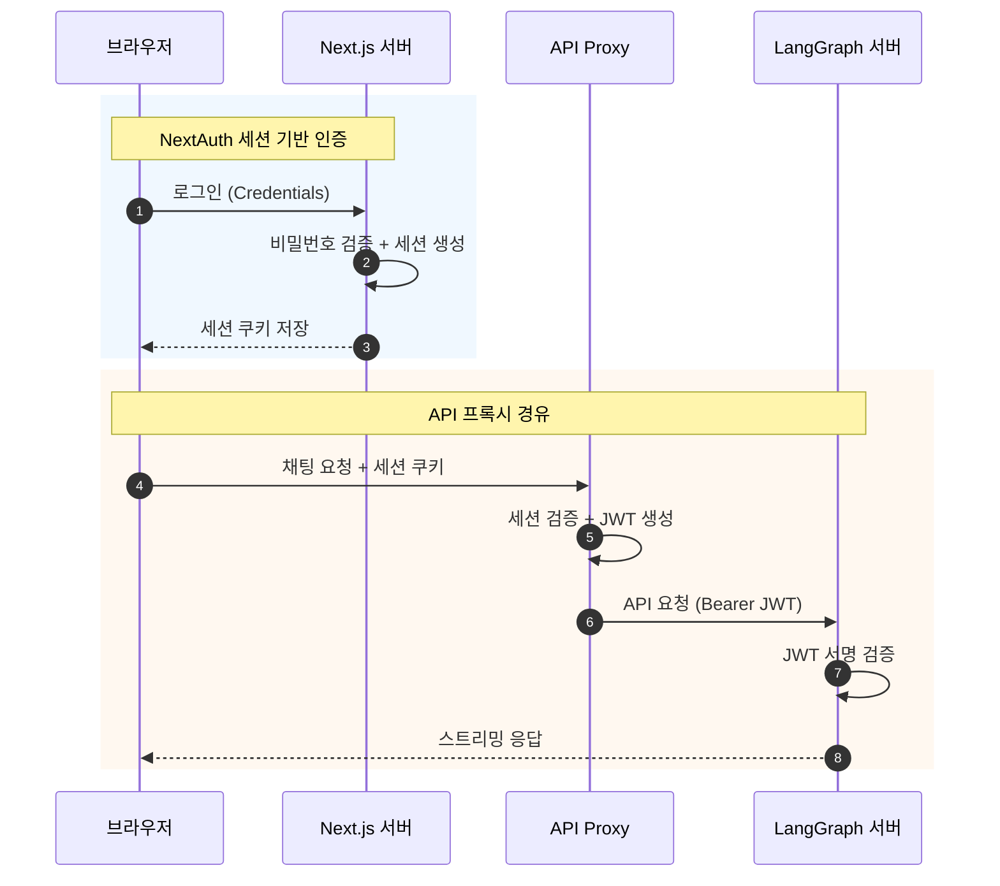
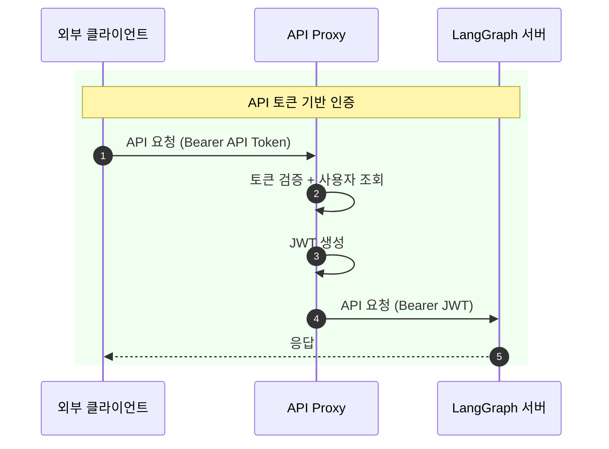

# 프론트엔드 호환성 분석

이 문서는 LangGraph Chat UI 프로젝트의 인증 호환성을 분석합니다.

## 목차

1. [개요](#개요)
2. [호환성 매트릭스](#호환성-매트릭스)
3. [현재 구현 상태](#현재-구현-상태)
4. [각 인증 방식별 호환성 분석](#각-인증-방식별-호환성-분석)
5. [프론트엔드 수정 가이드](#프론트엔드-수정-가이드)
6. [핵심 파일 참조](#핵심-파일-참조)
7. [추후 작업](#추후-작업)

---

## 개요

### 프로젝트 목적

이 프로젝트는 LangGraph 서버에 바로 연동 가능한 프론트엔드 UI를 제공합니다. 주요 특징:

- **NextAuth 기반 인증**: 세션 관리 및 JWT 토큰 발급
- **API 프록시**: 브라우저 → Next.js → LangGraph 경로로 인증 토큰 자동 전달
- **외부 클라이언트 지원**: API 토큰을 통한 CLI/스크립트 접근

### 현재 구현된 인증 방식

| 방식            | 설명                          |
| --------------- | ----------------------------- |
| **Credentials** | ID/PW 로그인 (완전 구현)      |
| **API Token**   | 외부 클라이언트용 Bearer 토큰 |

### 문서 범위

이 문서는 각 인증 가이드(01~05)에서 설명하는 방식이 현재 프론트엔드와 얼마나 호환되는지 분석합니다.

---

## 호환성 매트릭스

| 인증 방식            | 문서                               | 구현 상태    | 난이도 | 필요 작업                          |
| -------------------- | ---------------------------------- | ------------ | ------ | ---------------------------------- |
| NextAuth OAuth       | [01](./01-NEXTAUTH-OAUTH.md)       | ❌ 미구현    | 낮음   | Provider 추가, 환경변수 설정       |
| NextAuth Credentials | [02](./02-NEXTAUTH-CREDENTIALS.md) | ✅ 완전 구현 | -      | -                                  |
| NextAuth Email       | [03](./03-NEXTAUTH-EMAIL.md)       | ⚠️ 부분 준비 | 중간   | Email 서비스, PrismaAdapter 활성화 |
| OAuth Direct         | [04](./04-OAUTH-DIRECT.md)         | ❌ 미구현    | 높음   | 토큰 포맷 변경, 프록시 로직 수정   |
| Standalone           | [05](./05-STANDALONE.md)           | ⚠️ HS256만   | 중간   | RS256/JWKS 검증 추가               |

---

## 현재 구현 상태

### 완전히 지원되는 기능

#### 1. Credentials Provider (ID/Password)

```
✅ Prisma User 모델 (password, role, status 필드)
✅ bcryptjs 패스워드 해싱
✅ JWT 콜백에서 claims 추가 (id, role, status)
✅ 회원가입 API (/api/auth/register)
✅ 승인 워크플로우 (pending/active/suspended)
✅ 역할 기반 접근 제어 (user/admin/super_admin)
```

#### 2. JWT Bearer 토큰 생성

```
✅ HS256 알고리즘 서명
✅ 사용자 정보 포함 (sub, email, name, role, status)
✅ 1시간 만료 시간
✅ NEXTAUTH_SECRET 사용
```

#### 3. API 토큰 서비스

```
✅ 토큰 생성/조회/삭제 API (/api/auth/tokens)
✅ SHA256 해싱 저장
✅ 만료일 설정 가능
✅ 마지막 사용 시간 추적
✅ Audit 로깅
```

### 구현 아키텍처





### 데이터베이스 스키마 (Prisma)

현재 구현된 모델:

| 모델                | 용도                                        | 상태             |
| ------------------- | ------------------------------------------- | ---------------- |
| `User`              | 사용자 정보 (email, password, role, status) | ✅ 사용 중       |
| `Account`           | OAuth 계정 연결                             | ⚠️ 스키마만 존재 |
| `Session`           | DB 세션 저장 (JWT 전략 사용 시 미사용)      | ⚠️ 스키마만 존재 |
| `VerificationToken` | Email 인증 토큰                             | ⚠️ 스키마만 존재 |
| `ApiToken`          | 외부 클라이언트 API 토큰                    | ✅ 사용 중       |
| `AuditLog`          | 감사 로그                                   | ✅ 사용 중       |
| `GlobalSetting`     | 전역 설정                                   | ✅ 사용 중       |

---

## 각 인증 방식별 호환성 분석

### 4.1 NextAuth OAuth (01-NEXTAUTH-OAUTH.md)

**현재 상태:** ❌ 미구현

**준비된 인프라:**

- NextAuth 설정 파일 존재 (`src/lib/auth/config.ts`)
- Account 모델 정의됨 (Prisma 스키마)
- PrismaAdapter 임포트됨

**지원하려면 필요한 수정:**

1. **OAuth Provider 추가** (`src/lib/auth/config.ts`)

```typescript
import GoogleProvider from "next-auth/providers/google";
import GitHubProvider from "next-auth/providers/github";

providers: [
  // 기존 CredentialsProvider 유지
  CredentialsProvider({ ... }),

  // OAuth Provider 추가
  GoogleProvider({
    clientId: process.env.GOOGLE_CLIENT_ID!,
    clientSecret: process.env.GOOGLE_CLIENT_SECRET!,
  }),
  GitHubProvider({
    clientId: process.env.GITHUB_CLIENT_ID!,
    clientSecret: process.env.GITHUB_CLIENT_SECRET!,
  }),
]
```

2. **환경변수 추가** (`.env.local`)

```env
GOOGLE_CLIENT_ID=xxx
GOOGLE_CLIENT_SECRET=xxx
GITHUB_CLIENT_ID=xxx
GITHUB_CLIENT_SECRET=xxx
```

3. **JWT 콜백 확장** (provider 정보 추가)

```typescript
callbacks: {
  async jwt({ token, account, user }) {
    if (account) {
      token.provider = account.provider;
    }
    // 기존 로직 유지
    if (user) {
      token.id = user.id;
      token.role = user.role;
      token.status = user.status;
    }
    return token;
  },
}
```

**난이도:** 낮음 (NextAuth 구조가 이미 갖춰져 있음)

---

### 4.2 NextAuth Credentials (02-NEXTAUTH-CREDENTIALS.md)

**현재 상태:** ✅ 완전 구현

**구현된 항목:**

| 항목                               | 파일 위치                            |
| ---------------------------------- | ------------------------------------ |
| CredentialsProvider 설정           | `src/lib/auth/config.ts`             |
| 비밀번호 검증 (bcryptjs)           | `src/lib/auth/config.ts:40-44`       |
| User 상태 검사 (pending/suspended) | `src/lib/auth/config.ts:47-55`       |
| JWT 콜백 (id, role, status 추가)   | `src/lib/auth/config.ts:68-85`       |
| Session 콜백                       | `src/lib/auth/config.ts:87-94`       |
| 회원가입 API                       | `src/app/api/auth/register/route.ts` |
| 가입 정책 (approval/open)          | 관리자 설정으로 제어                 |

**추가 작업 불필요**

---

### 4.3 NextAuth Email (03-NEXTAUTH-EMAIL.md)

**현재 상태:** ⚠️ 부분 준비됨

**준비된 인프라:**

- VerificationToken 모델 정의됨 (Prisma 스키마)
- PrismaAdapter 임포트됨 (`src/lib/auth/config.ts:3`)

**지원하려면 필요한 수정:**

1. **Email Provider 추가** (`src/lib/auth/config.ts`)

```typescript
import EmailProvider from "next-auth/providers/email";

providers: [
  CredentialsProvider({ ... }),
  EmailProvider({
    server: {
      host: process.env.EMAIL_SERVER_HOST,
      port: Number(process.env.EMAIL_SERVER_PORT),
      auth: {
        user: process.env.EMAIL_SERVER_USER,
        pass: process.env.EMAIL_SERVER_PASSWORD,
      },
    },
    from: process.env.EMAIL_FROM,
  }),
]
```

2. **세션 전략 변경** (Email Provider는 database 전략 필요)

```typescript
// 현재: jwt 전략
session: {
  strategy: "jwt",  // ← Credentials 전용
}

// Email 지원 시: database 전략 또는 분기 처리 필요
```

3. **환경변수 추가**

```env
EMAIL_SERVER_HOST=smtp.gmail.com
EMAIL_SERVER_PORT=587
EMAIL_SERVER_USER=your-email@gmail.com
EMAIL_SERVER_PASSWORD=your-app-password
EMAIL_FROM=noreply@yourdomain.com
```

4. **Session 콜백 수정** (database 전략용)

```typescript
// database 전략 사용 시 token 대신 user 객체 사용
async session({ session, user }) {
  session.user.id = user.id;
  session.user.role = user.role;
  session.user.status = user.status;
  return session;
}
```

**난이도:** 중간 (세션 전략 변경이 필요할 수 있음)

**주의사항:**

- Credentials와 Email을 함께 사용하려면 별도 처리 필요 (Credentials는 JWT, Email은 database 전략)
- 또는 Email만 사용하는 경우 database 전략으로 전환

---

### 4.4 OAuth Direct (04-OAUTH-DIRECT.md)

**현재 상태:** ❌ 미구현

**개념:** NextAuth 없이 OAuth 토큰을 LangGraph가 직접 검증

**현재 아키텍처와의 차이:**

| 항목          | 현재 방식            | OAuth Direct                |
| ------------- | -------------------- | --------------------------- |
| 토큰 발급     | NextAuth (JWT)       | OAuth Provider              |
| 토큰 검증     | LangGraph (JWT 서명) | LangGraph (Provider API)    |
| 토큰 포맷     | `Bearer {jwt}`       | `Bearer {provider}:{token}` |
| Provider 의존 | 없음                 | 매 요청마다 API 호출        |

**지원하려면 필요한 수정:**

1. **API 프록시 수정** (`src/app/api/[..._path]/route.ts`)

현재 JWT를 생성하여 전달하는 방식에서, OAuth 토큰을 그대로 전달하도록 변경:

```typescript
// 현재 방식: JWT 생성하여 전달
const token = await new SignJWT({ ... })
  .setProtectedHeader({ alg: "HS256" })
  .sign(new TextEncoder().encode(process.env.NEXTAUTH_SECRET!));

// OAuth Direct 방식: 클라이언트 토큰 그대로 전달
const authHeader = req.headers.get("Authorization");
// 또는 provider:token 포맷으로 변환
```

2. **LangGraph 백엔드 수정 필요**

```python
# 현재: JWT 서명 검증
payload = jwt.decode(token, JWT_SECRET_KEY, algorithms=["HS256"])

# OAuth Direct: Provider API로 검증
async with httpx.AsyncClient() as client:
    response = await client.get(
        GOOGLE_USERINFO_URL,
        headers={"Authorization": f"Bearer {token}"}
    )
```

**난이도:** 높음 (프론트엔드와 백엔드 모두 수정 필요)

**사용 시나리오:**

- Next.js 프론트엔드 없이 CLI/모바일에서 직접 LangGraph 접근
- 기존 OAuth 토큰을 재사용해야 하는 경우

---

### 4.5 Standalone (05-STANDALONE.md)

**현재 상태:** ⚠️ HS256만 지원

**지원되는 것:**

- HS256 대칭키 JWT 검증 (현재 방식)
- Django, Express, Spring Boot 등 HS256 사용 시스템과 호환

**지원되지 않는 것:**

- RS256 비대칭키 JWT 검증 (JWKS)
- Supabase, Firebase, Keycloak 등 RS256 사용 시스템

**지원하려면 필요한 수정 (RS256/JWKS):**

1. **JWT 생성 모듈 확장** (`src/lib/auth/jwt.ts`)

```typescript
import { createRemoteJWKSet, jwtVerify } from "jose";

// JWKS 검증 함수 추가
export async function verifyExternalJWT(
  token: string,
): Promise<JWTPayload | null> {
  const jwksUrl = process.env.EXTERNAL_JWKS_URL;
  if (!jwksUrl) return null;

  try {
    const JWKS = createRemoteJWKSet(new URL(jwksUrl));
    const { payload } = await jwtVerify(token, JWKS, {
      algorithms: ["RS256"],
      issuer: process.env.EXTERNAL_JWT_ISSUER,
      audience: process.env.EXTERNAL_JWT_AUDIENCE,
    });
    return payload as JWTPayload;
  } catch {
    return null;
  }
}
```

2. **API 프록시 수정** (`src/app/api/[..._path]/route.ts`)

```typescript
// Bearer 토큰이 외부 시스템에서 온 경우 처리
const authHeader = req.headers.get("Authorization");
if (authHeader?.startsWith("Bearer ") && !session) {
  const externalToken = authHeader.substring(7);
  const payload = await verifyExternalJWT(externalToken);
  if (payload) {
    // 외부 토큰 검증 성공 → LangGraph용 JWT 재생성
  }
}
```

3. **환경변수 추가**

```env
# Supabase 예시
EXTERNAL_JWKS_URL=https://your-project.supabase.co/auth/v1/.well-known/jwks.json
EXTERNAL_JWT_AUDIENCE=authenticated

# Firebase 예시
EXTERNAL_JWKS_URL=https://www.googleapis.com/service_accounts/v1/jwk/securetoken@system.gserviceaccount.com
EXTERNAL_JWT_ISSUER=https://securetoken.google.com/your-project-id
EXTERNAL_JWT_AUDIENCE=your-project-id
```

**난이도:** 중간

---

## 프론트엔드 수정 가이드

### OAuth Provider 추가 예시

```typescript
// src/lib/auth/config.ts
import GoogleProvider from "next-auth/providers/google";
import GitHubProvider from "next-auth/providers/github";
import KakaoProvider from "next-auth/providers/kakao";

export const authConfig: NextAuthConfig = {
  // ... 기존 설정 유지
  providers: [
    // 기존 CredentialsProvider
    CredentialsProvider({
      // ... 현재 구현 유지
    }),

    // OAuth Providers 추가
    GoogleProvider({
      clientId: process.env.GOOGLE_CLIENT_ID!,
      clientSecret: process.env.GOOGLE_CLIENT_SECRET!,
    }),
    GitHubProvider({
      clientId: process.env.GITHUB_CLIENT_ID!,
      clientSecret: process.env.GITHUB_CLIENT_SECRET!,
    }),
    KakaoProvider({
      clientId: process.env.KAKAO_CLIENT_ID!,
      clientSecret: process.env.KAKAO_CLIENT_SECRET!,
    }),
  ],

  callbacks: {
    async jwt({ token, account, user }) {
      // OAuth 로그인 시 provider 정보 저장
      if (account) {
        token.provider = account.provider;
        token.providerAccountId = account.providerAccountId;
      }

      // 기존 Credentials 로직 유지
      if (user) {
        token.id = user.id;
        token.role = (user as { role?: string }).role;
        token.status = (user as { status?: string }).status;
      }

      return token;
    },

    async session({ session, token }) {
      if (token && session.user) {
        session.user.id = token.id as string;
        session.user.role = (token.role || "user") as string;
        session.user.status = (token.status || "active") as string;
        // OAuth provider 정보 추가
        if (token.provider) {
          session.user.provider = token.provider as string;
        }
      }
      return session;
    },
  },
};
```

### 로그인 UI 확장

```tsx
// src/app/login/page.tsx 또는 로그인 컴포넌트
import { signIn } from "next-auth/react";

export function LoginButtons() {
  return (
    <div className="space-y-4">
      {/* 기존 Credentials 폼 */}
      <form action={handleCredentialsLogin}>{/* ... */}</form>

      <div className="relative">
        <div className="absolute inset-0 flex items-center">
          <span className="w-full border-t" />
        </div>
        <div className="relative flex justify-center text-xs uppercase">
          <span className="bg-background text-muted-foreground px-2">또는</span>
        </div>
      </div>

      {/* OAuth 버튼 */}
      <button
        onClick={() => signIn("google", { callbackUrl: "/" })}
        className="flex w-full items-center justify-center gap-2 ..."
      >
        <GoogleIcon /> Google로 로그인
      </button>

      <button
        onClick={() => signIn("github", { callbackUrl: "/" })}
        className="flex w-full items-center justify-center gap-2 ..."
      >
        <GitHubIcon /> GitHub로 로그인
      </button>
    </div>
  );
}
```

---

## 핵심 파일 참조

| 파일                                      | 역할             | 수정 시 영향                      |
| ----------------------------------------- | ---------------- | --------------------------------- |
| `src/lib/auth/config.ts`                  | NextAuth 설정    | Provider 추가, 콜백 수정          |
| `src/lib/auth/jwt.ts`                     | JWT 생성 유틸    | 토큰 포맷, 서명 알고리즘          |
| `src/app/api/[..._path]/route.ts`         | API 프록시       | 인증 헤더 전달 방식               |
| `src/app/api/auth/[...nextauth]/route.ts` | NextAuth 라우트  | 이미 존재, 수정 불필요            |
| `src/app/api/auth/register/route.ts`      | 회원가입 API     | Credentials 전용                  |
| `src/app/api/auth/tokens/route.ts`        | API 토큰 관리    | 외부 클라이언트용                 |
| `src/lib/services/api-token.service.ts`   | 토큰 서비스 로직 | 토큰 생성/검증                    |
| `prisma/schema.prisma`                    | DB 스키마        | 새 모델 추가 시 마이그레이션 필요 |

---

## 추후 작업

### 구현 예정

- [ ] OAuth Provider 추가 (Google, GitHub)
- [ ] 로그인 UI에 OAuth 버튼 추가
- [ ] Email Magic Link 지원 (선택적)
- [ ] RS256/JWKS 검증 지원

### 통합 예제 (작성 예정)

| 예제             | 설명                    | 우선순위 |
| ---------------- | ----------------------- | -------- |
| OAuth (Google)   | Google 로그인 전체 설정 | 높음     |
| OAuth (GitHub)   | GitHub 로그인 전체 설정 | 높음     |
| Email Magic Link | 비밀번호 없는 로그인    | 중간     |
| Supabase Auth    | RS256 JWKS 연동         | 중간     |
| Firebase Auth    | RS256 JWKS 연동         | 중간     |
| Keycloak         | 기업용 SSO 연동         | 낮음     |

---

## 참고 자료

- [NextAuth.js Documentation](https://next-auth.js.org/)
- [NextAuth.js Providers](https://next-auth.js.org/providers/)
- [LangGraph Authentication](https://langchain-ai.github.io/langgraph/cloud/concepts/auth/)
- [JWT.io](https://jwt.io/)
- [JWKS (JSON Web Key Set)](https://auth0.com/docs/secure/tokens/json-web-tokens/json-web-key-sets)
