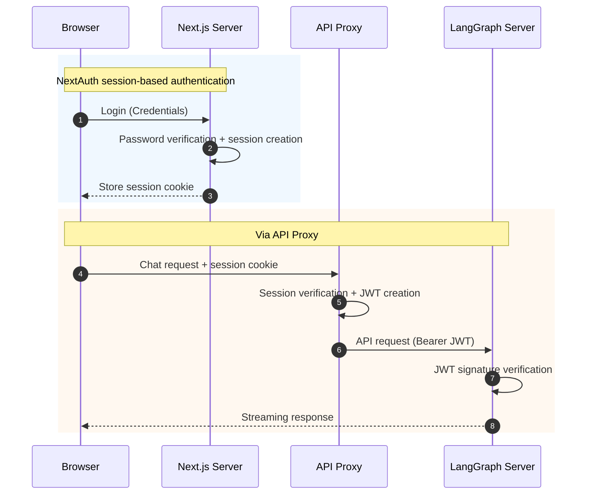
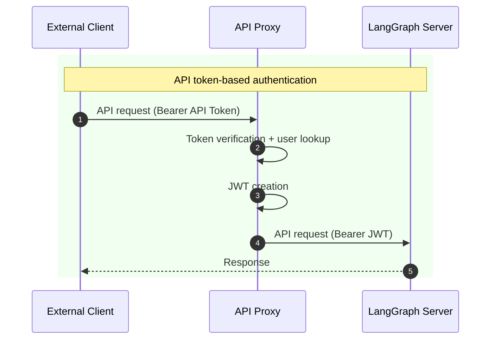

# Frontend Compatibility Analysis

This document analyzes the authentication compatibility of the LangGraph Chat UI project.

## Table of Contents

1. [Overview](#overview)
2. [Compatibility Matrix](#compatibility-matrix)
3. [Current Implementation Status](#current-implementation-status)
4. [Compatibility Analysis by Auth Method](#compatibility-analysis-by-auth-method)
5. [Frontend Modification Guide](#frontend-modification-guide)
6. [Key File Reference](#key-file-reference)
7. [Future Work](#future-work)

---

## Overview

### Project Purpose

This project provides a frontend UI that can be directly connected to a LangGraph server. Key features:

- **NextAuth-based Authentication**: Session management and JWT token issuance
- **API Proxy**: Automatic auth token forwarding via Browser -> Next.js -> LangGraph path
- **External Client Support**: CLI/script access via API tokens

### Currently Implemented Auth Methods

| Method          | Description                        |
| --------------- | ---------------------------------- |
| **Credentials** | ID/PW login (fully implemented)    |
| **API Token**   | Bearer token for external clients  |

### Document Scope

This document analyzes how compatible each authentication method described in the guides (01-05) is with the current frontend.

---

## Compatibility Matrix

| Auth Method          | Document                           | Implementation Status | Difficulty | Required Work                            |
| -------------------- | ---------------------------------- | --------------------- | ---------- | ---------------------------------------- |
| NextAuth OAuth       | [01](./01-NEXTAUTH-OAUTH.md)       | Not implemented       | Low        | Add Provider, configure env variables    |
| NextAuth Credentials | [02](./02-NEXTAUTH-CREDENTIALS.md) | Fully implemented     | -          | -                                        |
| NextAuth Email       | [03](./03-NEXTAUTH-EMAIL.md)       | Partially ready       | Medium     | Email service, enable PrismaAdapter      |
| OAuth Direct         | [04](./04-OAUTH-DIRECT.md)         | Not implemented       | High       | Change token format, modify proxy logic  |
| Standalone           | [05](./05-STANDALONE.md)           | HS256 only            | Medium     | Add RS256/JWKS verification              |

---

## Current Implementation Status

### Fully Supported Features

#### 1. Credentials Provider (ID/Password)

```
Prisma User model (password, role, status fields)
bcryptjs password hashing
JWT callback with added claims (id, role, status)
Registration API (/api/auth/register)
Approval workflow (pending/active/suspended)
Role-based access control (user/admin/super_admin)
```

#### 2. JWT Bearer Token Generation

```
HS256 algorithm signing
User information included (sub, email, name, role, status)
1-hour expiration time
Uses NEXTAUTH_SECRET
```

#### 3. API Token Service

```
Token create/read/delete API (/api/auth/tokens)
SHA256 hashed storage
Configurable expiration date
Last used time tracking
Audit logging
```

### Implementation Architecture





### Database Schema (Prisma)

Currently implemented models:

| Model               | Purpose                                      | Status              |
| ------------------- | -------------------------------------------- | ------------------- |
| `User`              | User info (email, password, role, status)     | In use              |
| `Account`           | OAuth account linking                         | Schema only         |
| `Session`           | DB session storage (unused with JWT strategy) | Schema only         |
| `VerificationToken` | Email verification tokens                     | Schema only         |
| `ApiToken`          | External client API tokens                    | In use              |
| `AuditLog`          | Audit logs                                    | In use              |
| `GlobalSetting`     | Global settings                               | In use              |

---

## Compatibility Analysis by Auth Method

### 4.1 NextAuth OAuth (01-NEXTAUTH-OAUTH.md)

**Current Status:** Not implemented

**Existing Infrastructure:**

- NextAuth config file exists (`src/lib/auth/config.ts`)
- Account model defined (Prisma schema)
- PrismaAdapter imported

**Required Modifications:**

1. **Add OAuth Provider** (`src/lib/auth/config.ts`)

```typescript
import GoogleProvider from "next-auth/providers/google";
import GitHubProvider from "next-auth/providers/github";

providers: [
  // Keep existing CredentialsProvider
  CredentialsProvider({ ... }),

  // Add OAuth Providers
  GoogleProvider({
    clientId: process.env.GOOGLE_CLIENT_ID!,
    clientSecret: process.env.GOOGLE_CLIENT_SECRET!,
  }),
  GitHubProvider({
    clientId: process.env.GITHUB_CLIENT_ID!,
    clientSecret: process.env.GITHUB_CLIENT_SECRET!,
  }),
]
```

2. **Add Environment Variables** (`.env.local`)

```env
GOOGLE_CLIENT_ID=xxx
GOOGLE_CLIENT_SECRET=xxx
GITHUB_CLIENT_ID=xxx
GITHUB_CLIENT_SECRET=xxx
```

3. **Extend JWT Callback** (add provider info)

```typescript
callbacks: {
  async jwt({ token, account, user }) {
    if (account) {
      token.provider = account.provider;
    }
    // Keep existing logic
    if (user) {
      token.id = user.id;
      token.role = user.role;
      token.status = user.status;
    }
    return token;
  },
}
```

**Difficulty:** Low (NextAuth structure is already in place)

---

### 4.2 NextAuth Credentials (02-NEXTAUTH-CREDENTIALS.md)

**Current Status:** Fully implemented

**Implemented Items:**

| Item                                      | File Location                        |
| ----------------------------------------- | ------------------------------------ |
| CredentialsProvider configuration          | `src/lib/auth/config.ts`             |
| Password verification (bcryptjs)          | `src/lib/auth/config.ts:40-44`       |
| User status check (pending/suspended)     | `src/lib/auth/config.ts:47-55`       |
| JWT callback (id, role, status added)     | `src/lib/auth/config.ts:68-85`       |
| Session callback                          | `src/lib/auth/config.ts:87-94`       |
| Registration API                          | `src/app/api/auth/register/route.ts` |
| Registration policy (approval/open)       | Controlled via admin settings        |

**No additional work required**

---

### 4.3 NextAuth Email (03-NEXTAUTH-EMAIL.md)

**Current Status:** Partially ready

**Existing Infrastructure:**

- VerificationToken model defined (Prisma schema)
- PrismaAdapter imported (`src/lib/auth/config.ts:3`)

**Required Modifications:**

1. **Add Email Provider** (`src/lib/auth/config.ts`)

```typescript
import EmailProvider from "next-auth/providers/email";

providers: [
  CredentialsProvider({ ... }),
  EmailProvider({
    server: {
      host: process.env.EMAIL_SERVER_HOST,
      port: Number(process.env.EMAIL_SERVER_PORT),
      auth: {
        user: process.env.EMAIL_SERVER_USER,
        pass: process.env.EMAIL_SERVER_PASSWORD,
      },
    },
    from: process.env.EMAIL_FROM,
  }),
]
```

2. **Change Session Strategy** (Email Provider requires database strategy)

```typescript
// Current: jwt strategy
session: {
  strategy: "jwt",  // <- Credentials only
}

// For Email support: database strategy or conditional handling needed
```

3. **Add Environment Variables**

```env
EMAIL_SERVER_HOST=smtp.gmail.com
EMAIL_SERVER_PORT=587
EMAIL_SERVER_USER=your-email@gmail.com
EMAIL_SERVER_PASSWORD=your-app-password
EMAIL_FROM=noreply@yourdomain.com
```

4. **Modify Session Callback** (for database strategy)

```typescript
// When using database strategy, use user object instead of token
async session({ session, user }) {
  session.user.id = user.id;
  session.user.role = user.role;
  session.user.status = user.status;
  return session;
}
```

**Difficulty:** Medium (session strategy change may be required)

**Notes:**

- Using Credentials and Email together requires special handling (Credentials uses JWT, Email uses database strategy)
- Alternatively, switching entirely to database strategy if using Email only

---

### 4.4 OAuth Direct (04-OAUTH-DIRECT.md)

**Current Status:** Not implemented

**Concept:** LangGraph directly verifies OAuth tokens without NextAuth

**Differences from Current Architecture:**

| Item               | Current Method       | OAuth Direct                |
| ------------------ | -------------------- | --------------------------- |
| Token issuance     | NextAuth (JWT)       | OAuth Provider              |
| Token verification | LangGraph (JWT sig)  | LangGraph (Provider API)    |
| Token format       | `Bearer {jwt}`       | `Bearer {provider}:{token}` |
| Provider dependency| None                 | API call per request        |

**Required Modifications:**

1. **Modify API Proxy** (`src/app/api/[..._path]/route.ts`)

Change from creating and forwarding JWT to passing the OAuth token through directly:

```typescript
// Current method: Create and forward JWT
const token = await new SignJWT({ ... })
  .setProtectedHeader({ alg: "HS256" })
  .sign(new TextEncoder().encode(process.env.NEXTAUTH_SECRET!));

// OAuth Direct method: Pass client token through as-is
const authHeader = req.headers.get("Authorization");
// Or convert to provider:token format
```

2. **LangGraph Backend Modification Required**

```python
# Current: JWT signature verification
payload = jwt.decode(token, JWT_SECRET_KEY, algorithms=["HS256"])

# OAuth Direct: Verify via Provider API
async with httpx.AsyncClient() as client:
    response = await client.get(
        GOOGLE_USERINFO_URL,
        headers={"Authorization": f"Bearer {token}"}
    )
```

**Difficulty:** High (both frontend and backend modifications required)

**Use Cases:**

- Accessing LangGraph directly from CLI/mobile without a Next.js frontend
- When reusing existing OAuth tokens is necessary

---

### 4.5 Standalone (05-STANDALONE.md)

**Current Status:** HS256 only supported

**What is Supported:**

- HS256 symmetric key JWT verification (current method)
- Compatible with systems using HS256 such as Django, Express, Spring Boot

**What is Not Supported:**

- RS256 asymmetric key JWT verification (JWKS)
- Systems using RS256 such as Supabase, Firebase, Keycloak

**Required Modifications (RS256/JWKS):**

1. **Extend JWT Creation Module** (`src/lib/auth/jwt.ts`)

```typescript
import { createRemoteJWKSet, jwtVerify } from "jose";

// Add JWKS verification function
export async function verifyExternalJWT(
  token: string,
): Promise<JWTPayload | null> {
  const jwksUrl = process.env.EXTERNAL_JWKS_URL;
  if (!jwksUrl) return null;

  try {
    const JWKS = createRemoteJWKSet(new URL(jwksUrl));
    const { payload } = await jwtVerify(token, JWKS, {
      algorithms: ["RS256"],
      issuer: process.env.EXTERNAL_JWT_ISSUER,
      audience: process.env.EXTERNAL_JWT_AUDIENCE,
    });
    return payload as JWTPayload;
  } catch {
    return null;
  }
}
```

2. **Modify API Proxy** (`src/app/api/[..._path]/route.ts`)

```typescript
// Handle case where Bearer token comes from an external system
const authHeader = req.headers.get("Authorization");
if (authHeader?.startsWith("Bearer ") && !session) {
  const externalToken = authHeader.substring(7);
  const payload = await verifyExternalJWT(externalToken);
  if (payload) {
    // External token verified successfully -> regenerate JWT for LangGraph
  }
}
```

3. **Add Environment Variables**

```env
# Supabase example
EXTERNAL_JWKS_URL=https://your-project.supabase.co/auth/v1/.well-known/jwks.json
EXTERNAL_JWT_AUDIENCE=authenticated

# Firebase example
EXTERNAL_JWKS_URL=https://www.googleapis.com/service_accounts/v1/jwk/securetoken@system.gserviceaccount.com
EXTERNAL_JWT_ISSUER=https://securetoken.google.com/your-project-id
EXTERNAL_JWT_AUDIENCE=your-project-id
```

**Difficulty:** Medium

---

## Frontend Modification Guide

### OAuth Provider Addition Example

```typescript
// src/lib/auth/config.ts
import GoogleProvider from "next-auth/providers/google";
import GitHubProvider from "next-auth/providers/github";
import KakaoProvider from "next-auth/providers/kakao";

export const authConfig: NextAuthConfig = {
  // ... keep existing configuration
  providers: [
    // Existing CredentialsProvider
    CredentialsProvider({
      // ... keep current implementation
    }),

    // Add OAuth Providers
    GoogleProvider({
      clientId: process.env.GOOGLE_CLIENT_ID!,
      clientSecret: process.env.GOOGLE_CLIENT_SECRET!,
    }),
    GitHubProvider({
      clientId: process.env.GITHUB_CLIENT_ID!,
      clientSecret: process.env.GITHUB_CLIENT_SECRET!,
    }),
    KakaoProvider({
      clientId: process.env.KAKAO_CLIENT_ID!,
      clientSecret: process.env.KAKAO_CLIENT_SECRET!,
    }),
  ],

  callbacks: {
    async jwt({ token, account, user }) {
      // Save provider info on OAuth login
      if (account) {
        token.provider = account.provider;
        token.providerAccountId = account.providerAccountId;
      }

      // Keep existing Credentials logic
      if (user) {
        token.id = user.id;
        token.role = (user as { role?: string }).role;
        token.status = (user as { status?: string }).status;
      }

      return token;
    },

    async session({ session, token }) {
      if (token && session.user) {
        session.user.id = token.id as string;
        session.user.role = (token.role || "user") as string;
        session.user.status = (token.status || "active") as string;
        // Add OAuth provider info
        if (token.provider) {
          session.user.provider = token.provider as string;
        }
      }
      return session;
    },
  },
};
```

### Login UI Extension

```tsx
// src/app/login/page.tsx or login component
import { signIn } from "next-auth/react";

export function LoginButtons() {
  return (
    <div className="space-y-4">
      {/* Existing Credentials form */}
      <form action={handleCredentialsLogin}>{/* ... */}</form>

      <div className="relative">
        <div className="absolute inset-0 flex items-center">
          <span className="w-full border-t" />
        </div>
        <div className="relative flex justify-center text-xs uppercase">
          <span className="bg-background text-muted-foreground px-2">or</span>
        </div>
      </div>

      {/* OAuth buttons */}
      <button
        onClick={() => signIn("google", { callbackUrl: "/" })}
        className="flex w-full items-center justify-center gap-2 ..."
      >
        <GoogleIcon /> Sign in with Google
      </button>

      <button
        onClick={() => signIn("github", { callbackUrl: "/" })}
        className="flex w-full items-center justify-center gap-2 ..."
      >
        <GitHubIcon /> Sign in with GitHub
      </button>
    </div>
  );
}
```

---

## Key File Reference

| File                                      | Role              | Impact When Modified                   |
| ----------------------------------------- | ----------------- | -------------------------------------- |
| `src/lib/auth/config.ts`                  | NextAuth config   | Provider additions, callback changes   |
| `src/lib/auth/jwt.ts`                     | JWT creation util | Token format, signing algorithm        |
| `src/app/api/[..._path]/route.ts`         | API proxy         | Auth header forwarding method          |
| `src/app/api/auth/[...nextauth]/route.ts` | NextAuth route    | Already exists, no modification needed |
| `src/app/api/auth/register/route.ts`      | Registration API  | Credentials only                       |
| `src/app/api/auth/tokens/route.ts`        | API token mgmt    | For external clients                   |
| `src/lib/services/api-token.service.ts`   | Token service     | Token creation/verification            |
| `prisma/schema.prisma`                    | DB schema         | Migration needed when adding models    |

---

## Future Work

### Planned Implementation

- [ ] Add OAuth Providers (Google, GitHub)
- [ ] Add OAuth buttons to login UI
- [ ] Email Magic Link support (optional)
- [ ] RS256/JWKS verification support

### Integration Examples (To Be Written)

| Example          | Description              | Priority |
| ---------------- | ------------------------ | -------- |
| OAuth (Google)   | Full Google login setup  | High     |
| OAuth (GitHub)   | Full GitHub login setup  | High     |
| Email Magic Link | Passwordless login       | Medium   |
| Supabase Auth    | RS256 JWKS integration   | Medium   |
| Firebase Auth    | RS256 JWKS integration   | Medium   |
| Keycloak         | Enterprise SSO integration | Low    |

---

## References

- [NextAuth.js Documentation](https://next-auth.js.org/)
- [NextAuth.js Providers](https://next-auth.js.org/providers/)
- [LangGraph Authentication](https://langchain-ai.github.io/langgraph/cloud/concepts/auth/)
- [JWT.io](https://jwt.io/)
- [JWKS (JSON Web Key Set)](https://auth0.com/docs/secure/tokens/json-web-tokens/json-web-key-sets)
